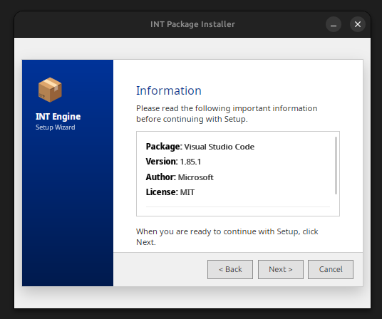
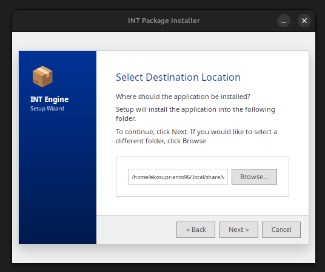
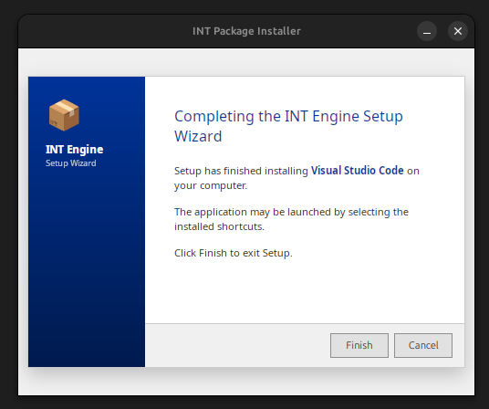

# INT Installer

**INT Installer** is an application installation framework for Linux inspired by Windows MSI. This system allows users to install applications by double-clicking `.int` files, which opens a Tauri-based GUI wizard installer.

## ⚠️ Project Status

This project is under active development. Current key components are ready for use:

- **✅ Available & Working**:
  - **Core Logic (`int-core`)**: Manifest parsing, payload extraction, installation validation.
  - **Packaging Tool (`int-pack`)**: CLI to create standard `.int` packages from source directories.
  - **Installer Engine (`int-engine`)**: Tauri-based GUI Installer (Vue.js + Rust) with a step-by-step wizard.
  - **System Integration**: Desktop entries (`.desktop`), MIME types, and systemd services.
  - **PolicyKit Integration**: System-wide installation support using `pkexec`.
  - **Security Signatures**: GPG signature verification for packages.
  - **Real-time Logging**: Live installation logs in GUI and CLI.

- **🚧 Work in Progress / Planned**:
  - **Auto Update**: Automatic application update mechanism is not yet available.

## 🎯 Key Features

- ✅ **Package Format**: tar.gz-based `.int` format with JSON manifest.
- ✅ **GUI Installer**: Interactive wizard using Tauri.
- ✅ **System Integration**: Desktop entries, systemd services, MIME types.
- ✅ **Security**: Path validation, sandboxing, permission checks.
- ✅ **Modular Architecture**: Clean, testable, extensible code.
- ✅ **Linux Native**: Follows freedesktop.org standards.
- ✅ **Automatic PATH Integration**: CLI binaries are automatically symlinked.

## 🖼️ Screenshots

<p align="center">
  
  
  
</p>

## 📦 Components

### 1. INT Package Format (`.int`)

The `.int` package is a tar.gz archive with a standard structure:

```
package.int
 ├── manifest.json       # Metadata and configuration
 ├── payload/           # Application files
 ├── scripts/           # Install/uninstall scripts
 └── services/          # systemd service files
```

### 2. INT Engine (Tauri GUI)

A Tauri application that acts as the installer engine:
- Multi-step wizard UI
- Progress tracking
- Error handling
- System integration

### 3. INT Pack (CLI Builder)

A tool to create `.int` packages:

```bash
int-pack build ./myapp --out myapp.int
```

## 🚀 Quick Start

### Prerequisites

- Rust 1.70+
- Node.js 18+ (for Tauri frontend)
- Linux (Ubuntu 22.04, Fedora 38, or later)

## 🚀 Installation Guide

There are three ways to install INT Installer on your system:

### Option 1: GitHub Releases (Fastest)
If you want to use the program directly without installing Rust or Node.js:
1. Go to the [Releases](https://github.com/ekosuprianto96/int-installer/releases) page.
2. Download the `int-pack` and `int-engine` binaries.
3. Place both files in the **root directory** of this project folder.
4. Run the following installation command:

```bash
# Skip the build stage and directly install the downloaded binaries
sudo ./install.sh --bin-only
```

### Option 2: Automated Source Build
Use the `install.sh` script to automatically build the frontend, compile binaries, and register the system from source code. (Requires Rust & Node.js).

```bash
git clone https://github.com/ekosuprianto96/int-installer
cd int-installer

# Build from scratch and install to system
sudo ./install.sh
```

### Option 3: Manual Build & Install
For developers who want to perform each stage manually.

```bash
# 1. Build Frontend
cd crates/int-engine/src-ui
npm install && npm run build
cd ../../../

# 2. Build Rust Binaries
cargo build --release

# 3. Run Install Script (for system registration & MIME)
sudo ./install.sh --bin-only
```

---

The `install.sh` script will perform the following:
1. Build Vue.js frontend (if not --bin-only)
2. Compile Rust binaries (`int-engine` and `int-pack`) (if not --bin-only)
3. Install binaries to `~/.local/bin`
4. Register desktop entries and system MIME types

### Creating a Package

```bash
# Create project structure
int-pack init myapp

# Edit manifest.json and add files to payload/

# Build package
int-pack build myapp --out myapp.int

# Build and sign package
int-pack build myapp --sign
```

### Installing a Package

```bash
# Double-click myapp.int in the file manager
# Or run from the command line:
int-engine myapp.int
```

## 📖 Documentation

- [Architecture](./ARCHITECTURE.md) - System design and architecture
- [Project Structure](./PROJECT_STRUCTURE.md) - Code organization
- [Manifest Specification](./docs/manifest-spec.md) - manifest.json format
- [Developer Guide](./docs/developer-guide.md) - Guide for developers
- [User Guide](./docs/user-guide.md) - Guide for end users
- [Security](./docs/security.md) - Security model and best practices

## 🏗️ Architecture

INT Installer uses a modular architecture:

```
┌─────────────────────────────────────┐
│     Tauri Frontend (TypeScript)     │
│  - Wizard UI, Progress, Errors      │
└─────────────┬───────────────────────┘
              │ IPC Commands
┌─────────────▼───────────────────────┐
│     Tauri Backend (Rust)            │
│  - Command handlers, State          │
└─────────────┬───────────────────────┘
              │
┌─────────────▼───────────────────────┐
│     Core Library (Rust)             │
│  - manifest, extractor, installer   │
│  - service, desktop, security       │
└─────────────────────────────────────┘
```

## 🔒 Security

INT Installer is designed with security as a priority:

- ✅ **Path Validation**: Prevents path traversal attacks
- ✅ **Sandboxed Execution**: Scripts run with strict control
- ✅ **Permission Checks**: User vs system scope validation
- ✅ **Signature Verification**: GPG signature support (`.int.sig`)
- ✅ **Safe Uninstall**: Prevents deletion of system directories
- ✅ **Elevated Privileges**: Secure elevation via PolicyKit (`pkexec`)

## 📝 Manifest Example

```json
{
  "version": "1.0",
  "name": "myapp",
  "display_name": "My Application",
  "package_version": "1.0.0",
  "description": "A sample application",
  "install_scope": "user",
  "install_path": "/home/user/.local/share/myapp",
  "entry": "myapp",
  "service": true,
  "desktop": {
    "categories": ["Development"],
    "icon": "myapp",
    "show_in_menu": true
  }
}
```

## 🛠️ Development

### Project Structure

```
int-installer/
├── crates/
│   ├── int-core/      # Core library
│   ├── int-engine/    # Tauri GUI installer
│   └── int-pack/      # CLI builder tool
├── docs/              # Documentation
├── examples/          # Example packages
├── integration/       # Linux integration files
└── tests/             # Tests
```

### Running Tests

```bash
# Unit tests
cargo test --all

# Integration tests
cargo test --test integration_tests

# Specific module tests
cargo test -p int-core --lib manifest
```

### Code Quality

```bash
# Format code
cargo fmt --all

# Lint
cargo clippy --all -- -D warnings

# Check
cargo check --all
```

## 🤝 Contributing

Contributions are welcome! Please read our [Contributing Guide](CONTRIBUTING.md) for details.

1. Fork the repository
2. Create feature branch (`git checkout -b feature/amazing-feature`)
3. Commit changes (`git commit -m 'Add amazing feature'`)
4. Push to branch (`git push origin feature/amazing-feature`)
5. Open Pull Request

## 📄 License

This project is dual-licensed under:

- MIT License ([LICENSE-MIT](LICENSE-MIT))
- Apache License 2.0 ([LICENSE-APACHE](LICENSE-APACHE))

You may choose either license for your use.

## 🙏 Acknowledgments

- Inspired by Windows MSI and Linux package managers
- Built with [Tauri](https://tauri.app/)
- Follows [freedesktop.org](https://www.freedesktop.org/) standards

## 📧 Contact

- Project Link: https://github.com/ekosuprianto96/int-installer
- Issues: https://github.com/ekosuprianto96/int-installer/issues
- Discussions: https://github.com/ekosuprianto96/int-installer/discussions

## 🗺️ Roadmap

- [x] Core library implementation
- [x] Basic Tauri GUI
- [x] systemd integration
- [x] Desktop entry support
- [x] Tauri frontend complete UI
- [x] PolicyKit integration
- [x] GPG signature verification
- [x] Real-time installation logs
- [ ] Update mechanism
- [ ] Plugin system
- [ ] Flatpak/AppImage conversion
- [ ] Multi-language support

---

**Made with ❤️ for the Linux community**
